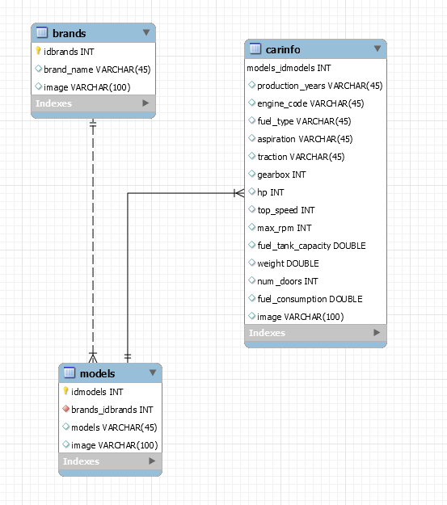

# InfoCar

![lastUpdate]https://img.shields.io/github/last-commit/X-Rafaelim/InfoCar

## Introduction

InfoCar was an app designed to be evaluated as my final project in my professional course that in portugue is called PAP(Prova de Aptidão Profissional).

InforCar is an Android Phone APP about car information like :
* Horse Power
* Weight
* Num of doors

The project consists in a creation of an DataBase in MYSQL an API in PHP that runs in a AWS server and in the Frontend i have an phone app that receive the information.


## DataBase

The Database is simple only have 3 tables that on contains the car brands the other the models of the cars and in the final table table we have the information about the model

Here is a photo of the DataBase




## API

The Api was made in PHP and runs in one aws web server that was configurated on one instance using apache2, the only does GET methods and the GET returns all the information on the table, in the example bellow you can see the response that ask for the information about brands:

```
{
    "records": [
        {
            "idbrands": "1",
            "brand_name": "BMW",
            "image": "https://logosmarcas.net/wp-content/uploads/2020/04/BMW-Logo-2020-.....jpg"
        },
        {
            "idbrands": "2",
            "brand_name": "Mercedes",
            "image": "https://i.pinimg.com/originals/03/e1/b0/03e1b0207489ad32d10b9a860ffc6623.png"
        },
        {
            "idbrands": "3",
            "brand_name": "Renault",
            "image": "https://i.pinimg.com/originals/f5/ac/15/f5ac1518c0a97c0346fa3e82084ef9c0.jpg"
        },
        {
            "idbrands": "4",
            "brand_name": "Nissan",
            "image": "https://upload.wikimedia.org/wikipedia/commons/thumb/6/67/Nissan-logo.svg/1189px-Nissan-logo.svg.png"
        }
    ]
}
```
